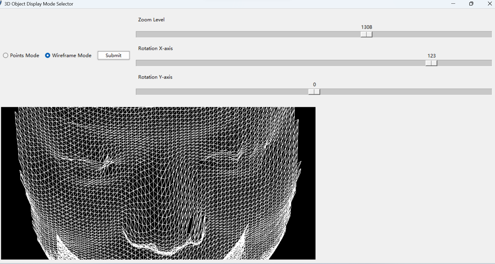
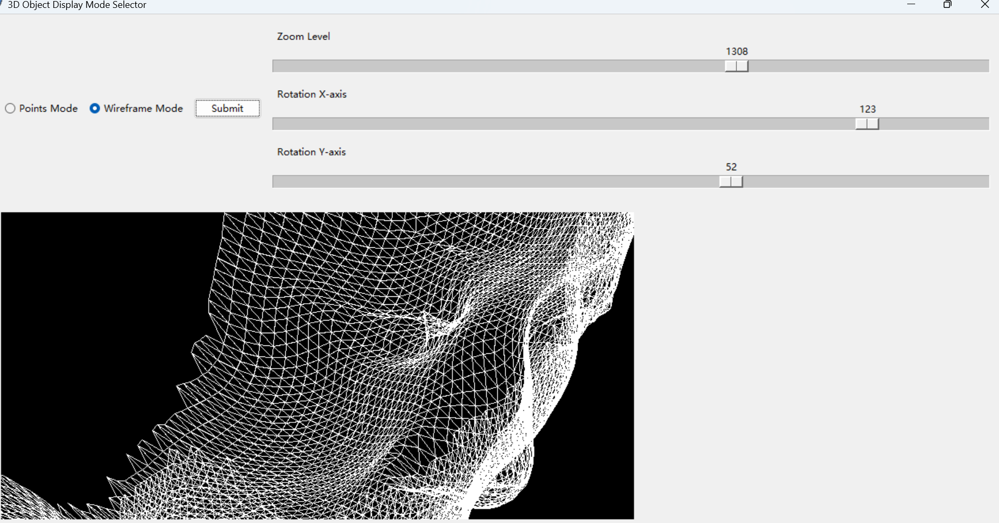

# 3D Face Projection
This repository contains the code and resources for the Face Projection assignment.

This project provides a visualization tool for displaying 3D objects (specifically faces) in a 2D space using projection. The tool allows users to interactively adjust the viewing angle and zoom level.
## Features

- **Interactive GUI**: Utilizes the `tkinter` library for a user-friendly interface.
- **Mode Selector**: Users can choose between two modes: 'Points Mode' and 'Wireframe Mode' to visualize the face projection.
- **Zoom Control**: Adjustable zoom level using a scale slider.
- **Rotation Control**: Users can control the rotation along the X and Y axes.
  
## Usage

1. Clone the repository.
2. Navigate to the project directory.
3. Run the main program.

## Dependencies

- `tkinter`
- `numpy`
- `matplotlib`
- `PIL`

## Results

## Future Improvements

- Extend support for different 3D objects.
- Enhance rendering speed and efficiency.
- Add more visualization modes and customizations.

## Contributing

Ningchen Liang nliang@scu.edu

Pull requests are welcome. For major changes, please open an issue first to discuss what you would like to change.
